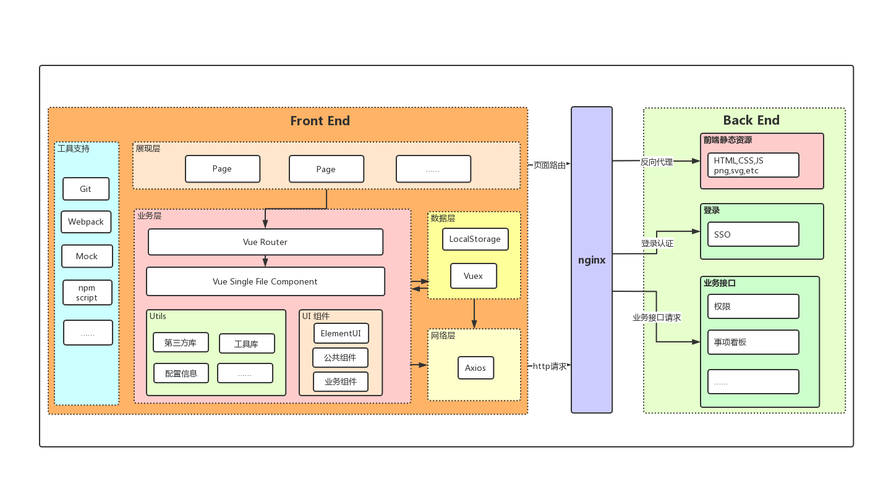
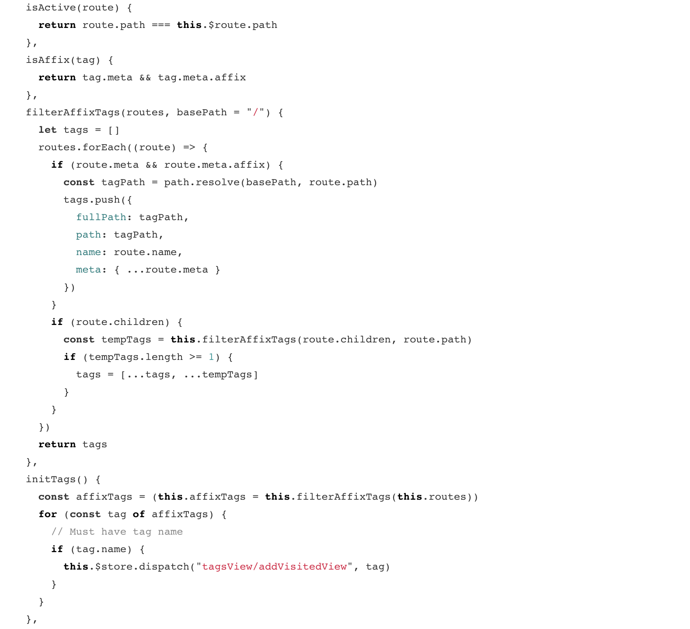
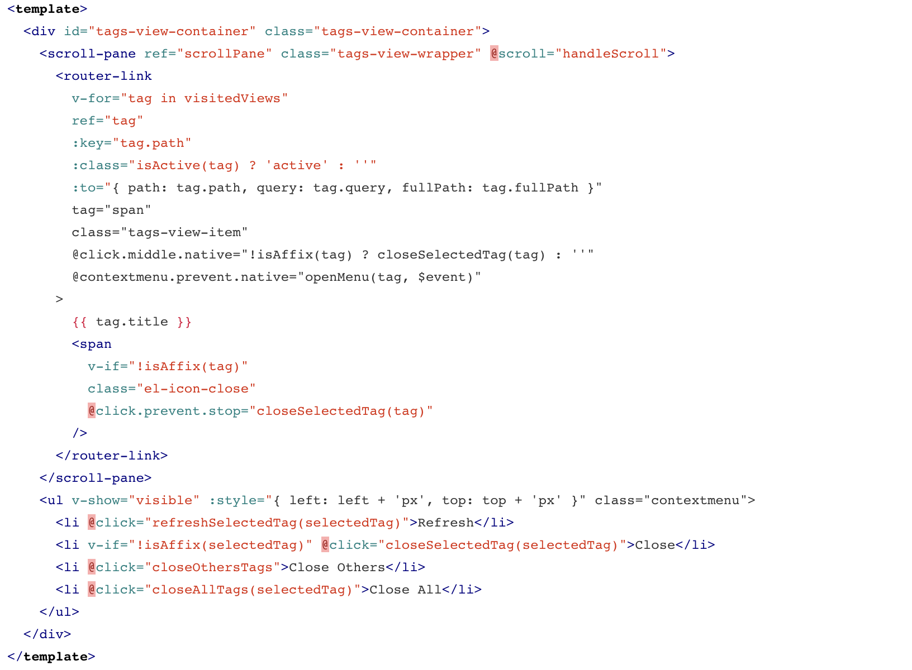

# 主题：SAAS后台 前端技术选型是如何决定的?

## 开篇

### 基础

```text
node.js
    node.js 是一个很强大的 js 运行环境，类似于 jvm 之于 java。因此对 js 的
支持非常好，催生了基于 js 的一系列应用开发。源于各 js 的应用的成长壮大，
继而催生出了 npm。
```

```text
npm包管理
    npm 是基于 node.js 环境的一个包管理器。试问为什么单纯的 jsp/php 里面没有 npm？
因为没有一个类似于 node.js 的强大的 js 运行环境的支撑。
由于 node.js 催生了 js 的兴盛，又进而催生出 npm 来打包管理这些基于 js 的应用。
```

## 中篇

### 基础

#### 为什么是 Vue？ 而不是 React And Angular

```text
    Vue,中文文档齐全,社区活跃，周边衍生开源产品很多，看着文档就能上手。不用像
Angular 一样要先了解 TS,RXJS 等概念。
React 系也有自己的一套规则, 如 JSX,Hooks 等。都是需要额外的学习，
Vue 原生 js 即可上手，限制没这么多，并且也支持 JSX 方式。
Vue 得天独厚支持 数据双向绑定(语法糖），减少重复性工作，便捷。
```

### 架构

#### Vue-cli 脚手架

```text
    随着前端开发的网页元素不断丰富和复杂化，催生出 webpack 来进一步规划
js 应用的打包部署。前端目标页面资源，通过 webpack 来打包压缩出来。
```



### 细节

#### 为什么 UI 框架(组件库）是 Element，而不是 iViewUI And Ant-design

```text
    UI框架选择就是纯粹比硬实力（开源社区活跃度，Issues 回应速度，版本迭代时间）
iViewUI 是个人独立开发维护的开源项目，后期解决方案让人担忧。
Ant-design 主要关注点在 React ,对 Vue 版本有滞后，不是亲儿子项目就是。
```

#### 为什么 css 预编译语言 是 stylus ，而不是 sass(scss) And Less

```text
    Sass 和 Stylus 都具有类语言的逻辑方式处理：条件、循环等，而 Less 需
要通过 When 等关键词模拟这些功能，这方面 Less 比不上 Sass 和 Stylus。
选择 Stylus，它的语法自由度很高，而且写出来的代码非常简洁。
```

```css
/*Scss、less混合语法*/
.circle{
  border-radius: 100%;
  background: #ccc;
}
.small-circle{
  width: 50px;
  height: 50px;
  .circle
}
/*Stylus Mixin混合语法*/
circle
  border-radius 100%
  background #ccc
.small-circle
  width 50px
  height 50px
  circle

/* 这是Scss样例 */
$test:300px;
.test_01{
  width: $test + 20px;
  height: $test * 2;
  color: #ccc - 10;
}
/* 这是Less样例 */
@test:300px;
.test_01{
  width: @test + 20px;
  height: @test * 2;
  color: #ccc - 10;
}
/* 这是Stylus样例 */
test=300px
.test_01
  width test + 20px
  height test * 2
  color #ccc - 10
......
```

#### 为什么网络请求工具是 Axios 而不是 fetch

```text
    对于有大量 HTTP 请求，需要良好的错误处理或 HTTP 拦截的应用，Axios是一个
更好的解决方案。在小型项目的情况下，只需要几个简单的 API 调用，fetch 也是一个
不错的解决方案。
    大多数浏览器和 Node.js 环境都支持 Axios，未来不排除有可能转为服务端渲染 
Axios 是首选第一序列，而现代浏览器仅支持 fetch (/* 不能直接传递JavaScript对象作
为参数、需要自己判断返回值类型，并执行响应获取返回值的方法、获取返回值方法只能调
用一次，不能多次调用、无法正常的捕获异常 */)。
```

```js
/* fetch请求 */
const options = {
    method: "POST", // 请求参数
    headers: { "Content-Type": "application/json"}, // 设置请求头
    body: JSON.stringify({name:'123'}), // 请求参数
    credentials: "same-origin", // cookie设置
    mode: "cors", // 跨域
}
fetch('http://www.xxx.com',options)
  .then(function(response) {
    return response.json();
  })
  .then(function(myJson) {
    console.log(myJson); // 响应数据
  })
  .catch(function(err){
    console.log(err); // 异常处理
  })

/* Axios请求 */
const service = axios.create({
  withCredentials: true, // 跨域请求时发送cookies
  timeout: 100000, // 请求超时
  transformResponse: [
    function (data) {
      try {
        // 如果转换成功则返回转换的数据结果
        return jsonBigint.parse(data)
      } catch (err) {
        // 如果转换失败，则包装为统一数据格式并返回
        return data
      }
    }
  ]
})

// 请求拦截器
service.interceptors.request.use(
  (config) => {
    if (store.getters.token) {
      config.headers["author-token"] = getToken() || ""
    }
    return config
  },
  (error) => {
    return Promise.reject(error)
  }
)

// 响应拦截器
service.interceptors.response.use(
  (response) => {
    const res = response.data
    if (res.errCode !== "0") {
      // 1: 系统故障; 2: 数据错误; 3: 无服务; 11: 未登录
      const resErrcode = ["1", "2", "3", "11","30"]
      if (resErrcode.includes(res.errCode)) {
        return Promise.reject(res)
      }else{
        return Promise.reject(res) 
      }
    } else {
      return res
    }
  },
  (error) => {
    return Promise.reject(error)
  }
)

// get
/**
  *  @params {params} 入参
  *  @params {versions} 版本号
  *  @returns {result}
  */
const $get = (url, { ...params }, versions = "/1") => {
  return service.get(`${url}${versions}${params}`)
}

// post
/**
  *  @params {url} 请求路径
  *  @params {params} 入参
  *  @params {versions} 版本号
  *  @params {defaultsParams} 默认固定参数。
  */
const d = new Date()
const gmtHours = d.getTimezoneOffset() / 60
const defaultsParams = {
  sign: "sign",
  appId: "1",
  timestamp: new Date().getTime(),
  timeZone: `GMT${gmtHours}`,
  language: store.getters.language
}
const $post = (url, params, versions = "/1") => {
  return service.post(`${url}${versions}`, {
    ...defaultsParams,
    ...params
  })
}

```

#### vue-router 路由

```text
Vue Router 是官方的路由管理器。它和 Vue.js 的核心深度集成，让构建单页
面应用变得易如反掌.
 （1）嵌套的路由
 （2）模块化的、基于组件的路由配置
 （3）路由参数、查询、通配符
 （4）以及后续我们项目的权限控制，也是有它来管理的。
```

```js
export const constantRoutes = [
  {
    path: "/redirect",
    component: () => import("@/components/FullPage/index.vue"),
    hidden: true,
    children: [
      {
        path: "/redirect/:path(.*)",
        component: () => import("@/components/redirect/index")
      }
    ]
  },
  // 重定向
  {
    path: "/",
    redirect: "/login"
  },
  // 登录页
  {
    path: "/login",
    name: "login",
    hidden: true,
    component: () => import("@/views/login/index.vue")
  },
  {
    path: "/404",
    component: () => import("@/components/404/index.vue"),
    hidden: true
  },
  {
    path: "/archives",
    name: "archives",
    meta: {
        title: "档案",
        icon: "icon-dangan"
    },
    component: () => import("@/components/FullPage/index.vue"),
    children: [
        {
            path: "/archives/archives-home",
            name: "ArchivesHome",
            meta: {
                title: "机构管理"
            },
            component: () => import("@/views"),
            redirect: "/archives/archives-main",
            children:[
                path: "/archives/organization/agency-divide",
                name: "AgencyDivide",
                meta: {
                    title: "机构分区",
                    icon: "",
                    noCache: false
                },
            component: () => import("@/views/archives/organization/AgencyDivide")
            ]
        }
        ......
     ]
  },
  ......
  // 404
  {
    path: "*",
    redirect: "/404",
    hidden: true
  }
]

// 动态请求回来的路由，（权限挂钩）
export const asyncRoutes = []

const router = createRouter()

router.beforeEach((to, from, next) => {
  next()
})

export function resetRouter() {
  const newRouter = createRouter()
  router.matcher = newRouter.matcher // 重置路由
}
```

### 其他

#### Eslint统一代码风格



#### Prettierrc 统一结构与样式风格




## 尾声

```text
今天的分享到此就结束了，综合以上所讲，构成了现在我们的项目。
```
