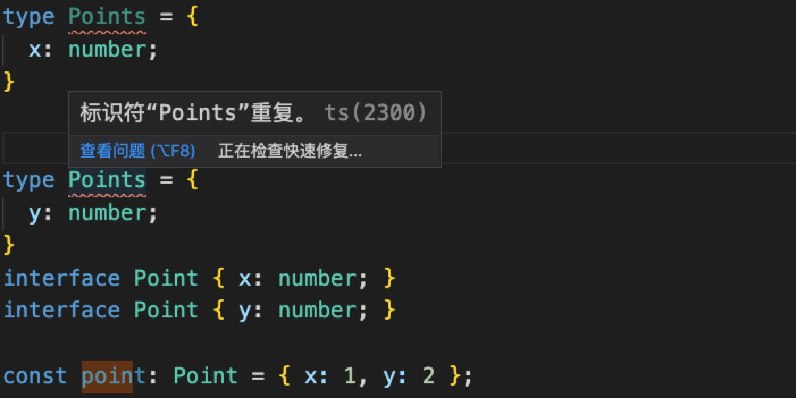
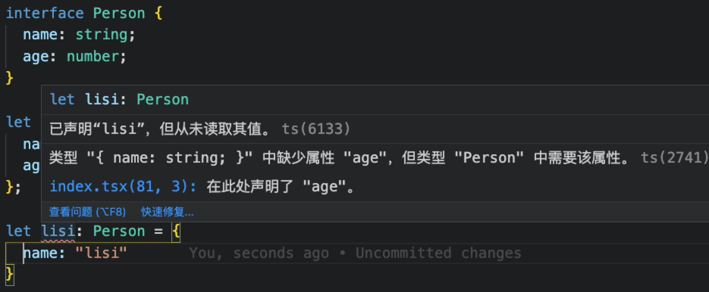
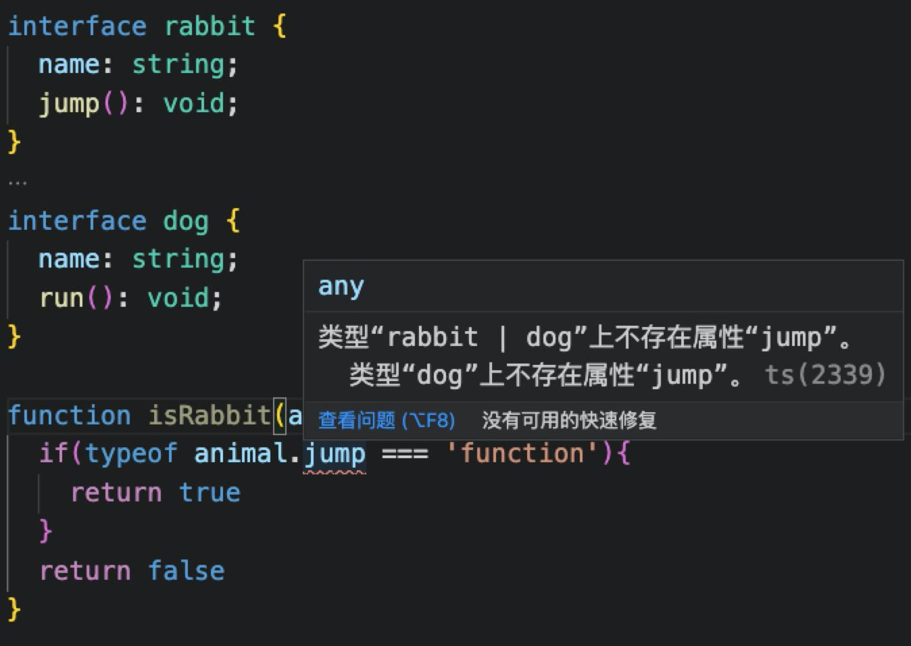
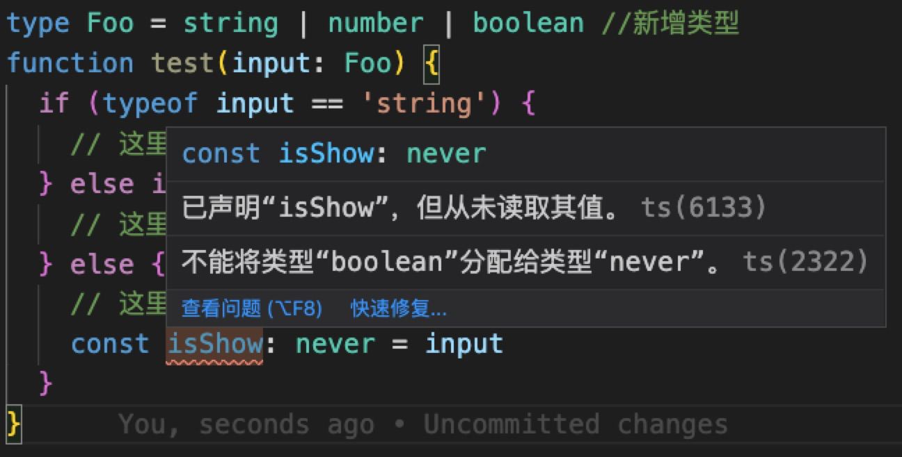
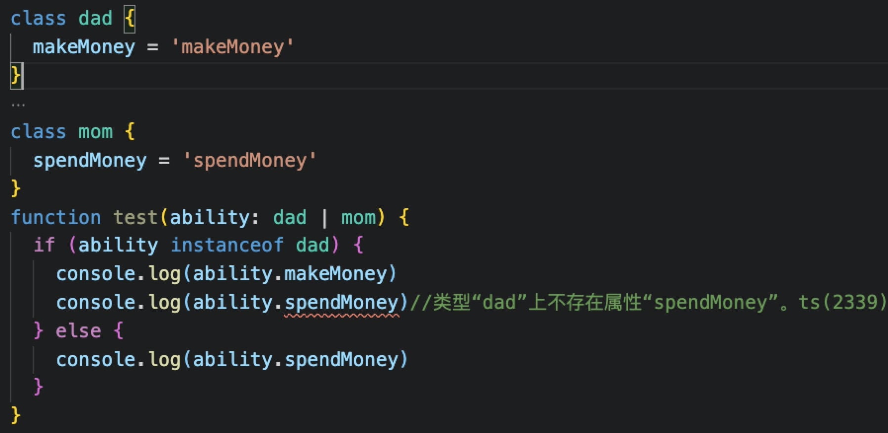
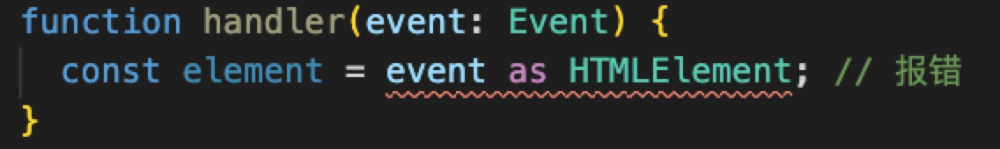
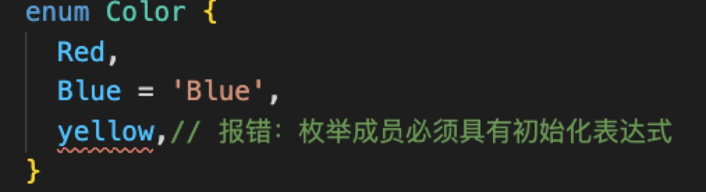
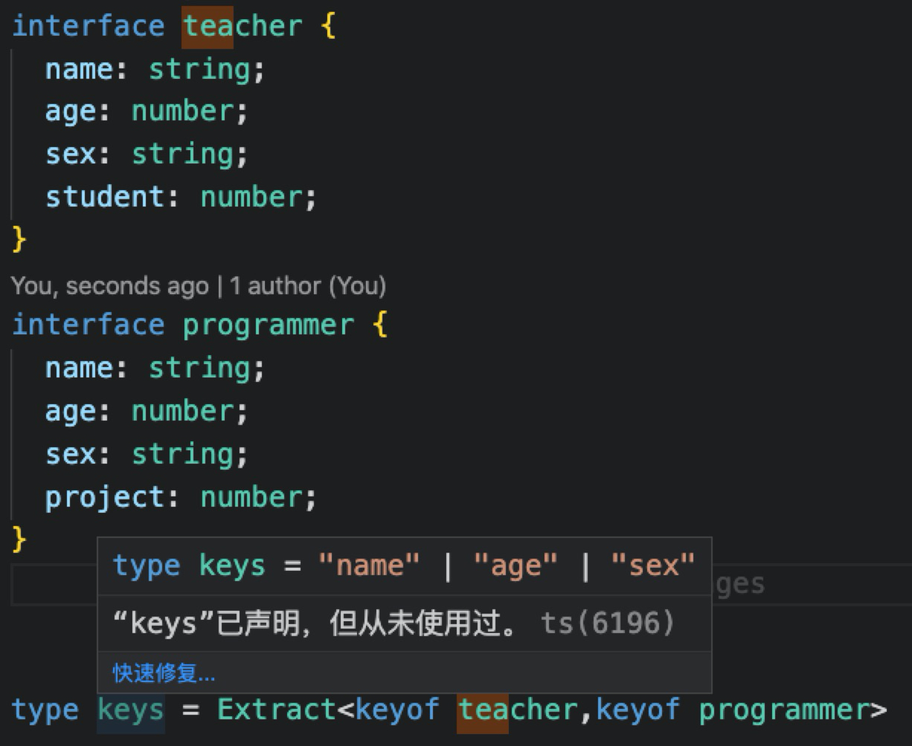
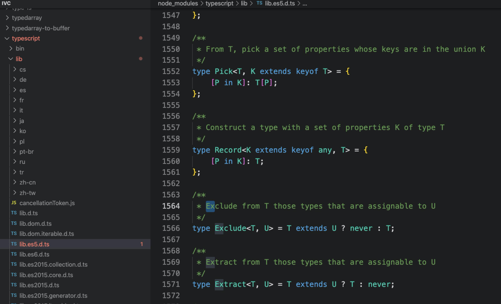
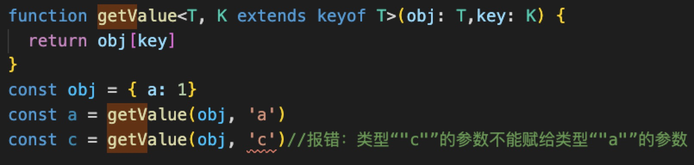

# 如何更好的使用TypeScript

## 一、养成“先思考后动手”的好习惯

在以往的开发过程中，习惯总是“先想好一个大概，然后边做边想再边改”。这样的优势是执行快，顺利的时候效率会很高，但更多的时候会不断地推翻自己先前的想法，相信不少的人也有跟我类似的体会。

`ts`是`js`的超集。意思就是在`ts`中可以直接书写`js`。在我的第一感觉里，`js`就像是编译后的可执行文件， `ts` 是强类型的语言，就像是`Java`语言。这也意味着它能有效制约开发者在开发过程中“随心所欲”的程度。下面开始具体介绍下它

## 1. 定义类型方式和扩展

* `TypeScript` 中定义类型有两种方式：接口（`interface`）和类型别名（`type alias`）。在下面的例子中，除了语法不一样，定义的类型是一样的:

```ts
// interface
interface PointI {
    x: number;
    y: number;
}
interface SetPointI {
    (x:number, y:number): void;
}

// or
// type alias
type PointT = {
    x: number;
    y: number;
}
type SetPointT = (x:number, y:number) => void;
```

* 接口和类型别名不仅均可以扩展，而且接口和类型别名并不互斥的，也就是说，接口可以扩展类型别名，类型别名也可以扩展接口

```ts
// interface extends type alias
type PointX = {
    x: number;
} 
interface PointY extends PointX {
    y: number;
}

// type alias extends interface
interface Point2X{
    x: number;
}
type Point2Y = Point2X & {y: number;}
```

* 接口和类型别名也有差别，比如一个接口可以定义多次，并将被视为一个接口，但是类型别名却不可以重复



**接口和类型别名的选用时机：**

* 在定义公共 API（如编辑一个库）时使用 `interface`，这样可以方便使用者继承接口；
* 在定义组件属性（`Props`）和状态（`State`）时，建议使用 `type`，因为 `type` 的约束性更强；
* `type` 类型不能二次编辑，而 `interface` 可以随时扩展。

## 2. TS 支持的 JS 新特性

**2.1 可选链（Optional Chaining）**

* TypeScript 3.7 实现了呼声最高的 ECMAScript 功能之一：可选链（Optional Chaining）。有了可选链后，我们编写代码时如果遇到 `null` 或 `undefined` 就可以立即停止某些表达式的运行。可选链的核心是新的 `?.` 运算符.

```ts
obj?.prop 
obj?.[expr] 
arr?.[index] 
func?.(args)
```

* **可选链（Optional Chaining）** `?.` 是 `ES11(ES2020)`新增的特性，**可选链**可以让我们在查询具有多层级的对象时，不再需要进行冗余的各种前置校验：

```ts
const age = user && user.info && user.info.getAge()
const age = user?.info?.getAge?.()
```

* 但需要注意的是，`?.` 与 && 运算符行为略有不同，`&& `专门用于检测 `false`值，比如空字符串、0、NaN、null 和 false 等。而 `?.` 只会验证对象是否为 `null` 或 `undefined`，对于 0 或空字符串来说，并不会出现 “短路”。

**2.2 可选属性**

在面向对象语言中，接口是一个很重要的概念，它是对行为的抽象，而具体如何行动需要由类去实现。 **TypeScript 中的接口是一个非常灵活的概念，除了可用于对类的一部分行为进行抽象以外，也常用于对「对象的形状（Shape）」进行描述**。 在 TypeScript 中使用 `interface` 关键字就可以声明一个接口：

```ts
interface Person { 
    name: string; 
    age: number; 
} 
let zhangsan: Person = { 
    name: "zhangsan",
    age: 33
};
```

* 上述代码中，我们声明了 `Person` 接口，它包含了两个必填的属性 `name` 和 `age`。在初始化 Person 类型变量时，如果缺少某个属性，TypeScript 编译器就会提示相应的错误信息，比如：



* 为了解决上述的问题，我们可以把某个属性声明为可选的：

```ts
interface Person { 
    name: string; 
    age?: number; 
}  
let lisi: Person = { 
    name: "lisi" 
}
```

**2.3 空值合并运算符（Nullish coalescing Operator）**

* 当空值合并运算符的左表达式不为 null 或 undefined 时，不会对右表达式进行求值。

```ts
const goods = {
    price: 0,
}
let goods1 = goods.price ?? '暂无报价'
let goods2 = goods.jdPrice ?? '暂无报价'
console.log(goods1) // 0
console.log(goods2) // 暂无报价
```

* 与逻辑或操作符（`||`） 不同，`||` 会在左侧操作数为 `false` 值（例如，`''` 或 `0`）时返回右侧操作数。也就是说，如果使用 `||` 来为某些变量设置默认值，可能会遇到意料之外的行为：

```ts
const goods = {
    price: 0,
}
let goods1 = goods.price || '暂无报价'
let goods2 = goods.price ?? '暂无报价'
console.log(goods1) // 暂无报价
console.log(goods2) // 0
```

**3.类型收窄**

- `TypeScript` 类型收窄就是从**宽类型**转换成**窄类型**的过程，其常用于处理联合类型变量的场景。
- 在 `TypeScript` 中，有许多方法可以收窄变量的类型：
    - 类型断言
    - 双重断言

**3.1 类型断言**
* 类型断言有两种： `值 as 类型` or `<类型>值`一般我们统一使用 `值 as 类型` 这样的语法，因为 `<>` 容易跟泛型语法起冲突。
* 当 `TypeScript` 不确定一个联合类型的变量到底是哪个类型的时候，我们**只能访问此联合类型的所有类型中共有的属性或方法**
```ts
interface rabbit {
    name: string;
    jump(): void;
}
interface dog {
    name: string;
    run(): void;
}
function isRabbit1(animal: rabbit | dog){
return animal.name
}
```
- 而有时候，我们确实需要在还不确定类型的时候就访问其中一个类型特有的属性或方法，如：



- 上图的例子中，获取 `animal.jump` 的时候会报错。此时可以使用类型断言，将 `animal` 断言成 `rabbit` 类型，就可以解决访问 `animal.jump` 时报错的问题：

```ts
interface rabbit {
    name: string;
    jump(): void;
}
interface dog {
    name: string;
    run(): void;
}
function isRabbit(animal: rabbit | dog){
    if(typeof (animal as rabbit).jump === 'function'){
    return true
}
    return false
}
```

- 类型断言虽好，但是不能滥用，滥用之后可能会绕过编译器，但是无法避免`运行时`的错误。
```ts
interface rabbit {
    name: string;
    jump(): void;
}
interface dog {
    name: string;
    run(): void;
}
function rabbitJump(animal: rabbit | dog) {
    (animal as rabbit).jump()
}
const jack: dog = {
    name: 'Jack',
    run() {
        console.log("跑")
    }
}
rabbitJump(jack) // 运行会报错
```

- `TypeScript` 编译器信任了我们的断言，故在调用 `rabbitJump()` 时没有编译错误，但由于 `jack` 上并没有 `jump` 方法，就会导致在运行时发生错误。

- 使用类型断言时一定要格外小心，尽量避免断言后调用方法或引用深层属性，以减少不必要的运行时错误。

**3.2 类型守卫**
- 类型守卫主要有以下几种方式：
    - typeof：用于判断 `number`，`string`，`boolean`或 `symbol` 四种类型；
    - instanceof：用于判断一个实例是否属于某个类
    - in：用于判断一个属性/方法是否属于某个对象

- 可以利用 `typeof` 实现类型收窄和 `never` 类型的特性做全面性检查，如下面的代码所示：
```ts
type Foo = string | number 
function test(input: Foo) {
    if (typeof input == 'string') {
        // 这里 input 的类型「收紧」为 string
    } else if (typeof input == 'number') {
        // 这里 input 的类型「收紧」为 number
    } else {
        // 这里 input 的类型「收紧」为 never
        const isShow: never = input
    }
}
```
- 可以看到，在最后的 `else` 分支里面，我们把收窄为 `never` 的 `input` 赋值给一个显示声明的 `never` 变量，如果一切逻辑正确，那么这里应该能够编译通过。但是假如后来有一天你的同事修改了 `Foo` 的类型，并且忘记了修改test方法里面控制流的时候：



- 这时候 `else` 分支的 `input` 类型会被收窄为 `boolean` 类型，导致无法赋值给 `never` 类型，这时就会产生一个编译错误。

- 使用 `instanceof` 运算符收窄变量的类型



- 使用 `in` 做属性检查

```ts
interface Foo {
    foo: string;
}
interface Bar {
    bar: string;
}
function test(input: Foo | Bar) {
    if ('foo' in input) {
        // 这里 input 的类型「收紧」为 Foo
    } else {
        // 这里 input 的类型「收紧」为 Bar
    }
}
```

**3.3 双重断言**
- 类型断言并不总是能成功，比如： 



- 如上例子中的代码将会报错（类型 "Event" 到类型 "HTMLElement" 的转换可能是错误的，因为两种类型不能充分重叠。如果这是有意的...），尽管已经使用了类型断言。
- 如果你仍然想使用那个类型，你可以使用双重断言。首先断言成兼容所有类型的 `any`，编译器将不会报错：

```ts
function handler(event: Event) {
    const element = (event as any) as HTMLElement; // OK
}
```

- **TypeScript 是怎么确定单个断言是否足够 ?** 当 `S` 类型是 `T` 类型的子集，或者 `T` 类型是 `S` `类型的子集时，S` 能被成功断言成 `T`。这是为了在进行类型断言时提供额外的安全性，完全毫无根据的断言是危险的，如果你想这么做，你可以使用 `any`。

**4.枚举**
- 枚举是组织收集有关联变量的一种方式,首先我们看看普通枚举，如果你使用过其它编程语言应该会很熟悉。
```ts
enum Color {
    Red = 1, // 1
    Green, // 2
    Blue, // 3
}
```

- 如上，我们定义了一个数字枚举， `Red`使用初始化为 `1`。 其余的成员会从 `1`开始自动增长。 换句话说， `Color.Red`的值为 `1`， `Green`为 `2`， `Blue`为 `3`，Red要是没有初始化，即从`0`开始。 但是这样写就有问题了：



- 当枚举某个成员非数字时，下面增长的枚举成员需要和其保持一致，这样方能避免报错

```ts
enum Color {
    Red, // 0 
    Green = "Green", // Green
    Blue = "Blue", // Blue
}
```

- 普通枚举的值不会在编译阶段计算，而是保留到程序的执行阶段，我们看看下面的例子：
```ts

enum Color {
    //常量枚举
    Red, 
    purple,
    Green = Color.Red,
    Blue = 1 + 1,
    //非常量枚举
    yellow = Math.random(),
    black = 'hello'.length,
}
```

- 上例的编译结果是：

```ts
var Color;
(function(Color) {
    Color[(Color['Red'] = 0)] = 'Red';
    Color[(Color['purple'] = 0)] = 'purple';
    Color[(Color['Green'] = 0)] = 'Green';
    Color[(Color['Blue'] = 2)] = 'Blue';
    Color[(Color['yellow'] =  Math.random())] = 'yellow';
    Color[(Color['black'] = 'hello'.length)] = 'black';
})(Color || (Color = {}));
```

- 先让我们聚焦 `Color[(Color['Red'] = 0)] = 'Red'` 这行代码，其中 `Color['Red'] = 0` 的意思是将 `Color` 对象里的 `Red` 成员值设置为 `0`。注意，JavaScript 赋值运算符返回的值是被赋予的值（在此例子中是 `0`），因此下一次 JavaScript 运行时执行的代码是 `Color[0] = 'Red'`。意味着你可以使用 `Color` 变量来把字符串枚举类型改造成一个数字或者是数字类型的枚举类型，如下所示：

```ts
enum Color {
    Red, 
    Blue = 1 + 1,
    yellow = Math.random(),
    black = 'hello'.length,
}
console.log(Color[0]); // 'Red'
console.log(Color['Red']); // 0
console.log(Color[Color.Red]); // 'Red'
```

**5. 高级类型**
- 除了 string、number、boolean 这种基础类型外，我们还应该了解一些类型声明中的一些高级用法。

**5.1 `extends` 关键字**
- 基础用法：
```ts
T extends U ? X : Y
```

- 表示，如果 T 可以赋值给 U （类型兼容），则返回 X，否则返回 Y；以内置的泛型接口 `Extract` 为例，它的实现如下：
```ts
type Extract<T, U> = T extends U ? T : never
```
- `TypeScript` 将使用 `never` 类型来表示不应该存在的状态。上面的意思是，如果 `T` 中的类型在 `U` 存在，则返回，否则抛弃。
假设我们两个类，有三个公共的属性，可以通过 `Extract` 提取这三个公共属性：



`TypeScript` 中内置了很多工具泛型，除了介绍的这些，内置的泛型在 `TypeScript` 内置的 `lib.es5.d.ts` 中都有定义，所以不需要任何依赖就可以直接使用。



**5.2 使用 `keyof`**
- 基础实例：
```ts
interface Foo {
    name: string;
    age: number
}
type T = keyof Foo 
// 等同于
type T = "name" ｜ "age"
```
- `extends` 经常与 `keyof` 一起使用，例如我们有一个 `getValue` 方法专门用来获取对象的值，但是这个对象并不确定，我们就可以使用 `extends` 和 `keyof` 进行约束：



- 当传入对象没有的 `key` 时，编辑器则会报错。

**5.3 使用 `in`**

- `in`则可以遍历枚举类型, 例如：
```ts
type Keys = "a" | "b"
type Obj =  {
  [p in Keys]: any
} //  { a: any, b: any }
```

- `keyof` 产生联合类型, `in` 则可以遍历枚举类型, 所以他们经常一起使用。

**二、好的习惯都需要慢慢养成**

如果只是掌握了 TypeScript 的一些基础类型，可能很难游刃有余的去使用 TypeScript。想要很好的驾驭它，只能不断的学习和掌握它。

本次只是介绍了几种常用的实践，有机会我们可以在新的项目实践起来，努力提升代码可维护性和开发幸福感.

本次分享到此结束。

**三、参考文档**

1. [TypeScript 官方文档](https://www.typescriptlang.org/zh/docs/handbook/2/basic-types.html)。
